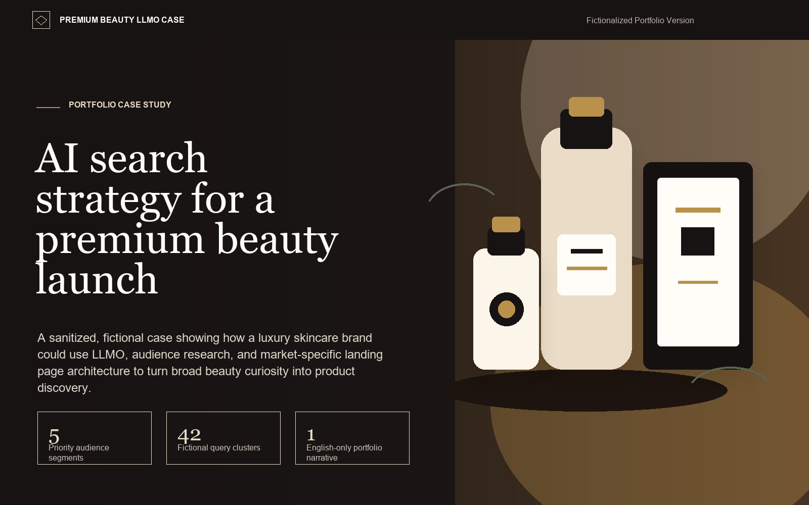

# Module C — Technical Architecture PRD
## UTAKATA LAB ウタカタ・ラボ · AI Digital Marketing Lab

**Version:** 1.1
**Date:** 2026-05-22
**Status:** Updated — reflects finalized Design PRD (Long Light palette, 3-font system) and Content PRD (blog inline expand, no About section, LinkedIn footer)

**Changelog v1.0 → v1.1:**
- Color tokens updated to confirmed "Long Light" palette (all placeholder values replaced)
- Space Grotesk added as `--font-heading` (3-font system from Module A)
- About section removed from HTML structure and navigation
- Writing/Blog section promoted from [FUTURE] to v1 scope
- Blog card architecture defined: inline expandable accordion (no separate post pages)
- LinkedIn social icon added to footer
- Extensibility markers updated accordingly

---

## 1. Architecture Principles

1. **Zero dependencies at runtime.** No npm, no build step, no server. The site is a single file that opens in a browser.
2. **Vibe-code friendly.** Every structural addition — new portfolio card, new blog post, new section — follows a clear pattern that can be prompted and inserted with minimal context.
3. **Future-proof without over-engineering.** Clear extension points are marked with comments. The architecture does not implement CMS or multi-page routing features but explicitly leaves room for them.
4. **Readable by a non-developer.** Code is commented in plain English. Variable names are semantic. No clever tricks that require framework knowledge to understand.

---

## 2. Stack

| Layer | Technology | Rationale |
|-------|-----------|-----------|
| Markup | HTML5 (semantic) | No framework. Semantic elements (`<section>`, `<article>`, `<nav>`) for accessibility and SEO. |
| Styling | CSS3 with Custom Properties | All design tokens as CSS variables in `:root`. No preprocessor needed. |
| Behavior | Vanilla JavaScript (ES6+) | Language toggle + card expand + blog accordion are the only JS features required. No jQuery. |
| Fonts | Google Fonts (preconnect) | DM Serif Display + Space Grotesk + Inter + Noto Sans/Serif JP, loaded via `<link>` with `display=swap`. |
| Icons | Inline SVG | Social icons and UI icons embedded inline — no icon library dependency. |
| Deployment | Vercel or GitHub Pages | Static file deployment. No server-side code. |

**Build process:** None. The deliverable is a single `index.html` file.

---

## 3. File Structure

```text
/
├── index.html
├── hero-illustration.png
├── README.md
├── tools/
│   ├── README.md
│   └── create_beacon_geo_ads.py
├── case-folder/
│   ├── beacon-geo-report/
│   │   ├── beacon-geo-report-Sample-en.pdf
│   │   ├── beacon-geo-ad-01-keyword-map.png
│   │   ├── beacon-geo-ad-02-ai-answer-capture.png
│   │   ├── beacon-geo-ad-03-visibility-metrics.png
│   │   ├── beacon-geo-ad-04-report-output.png
│   │   └── source-panels/
│   ├── luxury-beauty-llmo-case/
│   └── top-10-tech-trend-personality-test/
└── docs/                    -> tracked operational docs
```

> **Image path convention (v1):** Portfolio card images and Beacon GEO report assets reference `case-folder/` directly - no file migration required. When deploying to Vercel or GitHub Pages, ensure `case-folder/` is included alongside `index.html`.

> **Static asset note:** No root `/assets/` directory ships today. Favicon and dedicated OG assets remain future additions; follow `docs/PUBLISH_CHECKLIST.md` before adding them.

> **Monolith note:** `index.html` is now over 800 lines because v1 keeps HTML, CSS, and JavaScript together. Splitting CSS/JS is deferred to a separate refactor, not part of DOC-REM.
## 4. HTML Document Structure

```html
<!DOCTYPE html>
<html lang="en" data-lang="en">
<head>
  <!-- Meta, title, OG tags -->
  <!-- Google Fonts preconnect + stylesheet link -->
  <!-- Embedded <style> block with all CSS -->
</head>
<body>

  <!-- ============================================
       HEADER / NAVIGATION
       ============================================ -->
  <header id="site-header" class="site-header">
    <div class="container">
      <a href="#top" class="logo">UTAKATA LAB <span class="logo-jp">ウタカタ・ラボ</span></a>
      <nav class="site-nav">
        <!-- Nav links — EN and JP versions toggled by JS -->
        <a href="#portfolio" data-en="Work" data-jp="作品">Work</a>
        <a href="#writing" data-en="Writing" data-jp="考えること">Writing</a>
        <a href="#contact" data-en="Contact" data-jp="お問い合わせ">Contact</a>
      </nav>
      <!-- Language toggle button -->
      <button id="lang-toggle" class="lang-toggle" aria-label="Switch language">
        <span class="lang-option active" data-lang-label="en">EN</span>
        <span class="lang-separator">|</span>
        <span class="lang-option" data-lang-label="jp">JP</span>
      </button>
    </div>
  </header>

  <!-- ============================================
       HERO SECTION
       ============================================ -->
  <section id="top" class="section section--hero">
    <!-- Display heading (DM Serif Display), tagline, positioning statement, CTA -->
    <!-- Uses data-en / data-jp attributes for bilingual toggle -->
    <!-- Hero is pure typography — no background image or visual accent in v1 -->
  </section>

  <!-- ============================================
       PORTFOLIO SECTION
       ============================================ -->
  <section id="portfolio" class="section section--portfolio">
    <div class="container">
      <!-- Section label + intro copy (bilingual) -->

      <div class="portfolio-grid">

        <!-- ----------------------------------------
             PORTFOLIO CARD — INSERT NEW CARDS HERE
             Copy one <article class="card"> block
             to add a new project. See §5 for spec.
             ---------------------------------------- -->

        <!-- Card 1: LLMO -->
        <article class="card" data-card>...</article>

        <!-- Card 2: Interactive Content -->
        <article class="card" data-card>...</article>

        <!-- [EXTEND: NEW-CARD] Add new project cards above this comment -->

      </div>
    </div>
  </section>

  <!-- ============================================
       WRITING / BLOG SECTION
       ============================================ -->
  <section id="writing" class="section section--writing">
    <div class="container">
      <!-- Section label + optional intro copy (bilingual) -->

      <div class="blog-list">

        <!-- ----------------------------------------
             BLOG POST — INSERT NEW POSTS HERE
             Copy one <article class="blog-post"> block
             to add a new post. See §6 for spec.
             Full post body is embedded inline.
             ---------------------------------------- -->

        <!-- Post 1: What does an AI say about your brand? -->
        <article class="blog-post" data-blog-post>...</article>

        <!-- [EXTEND: NEW-POST] Add new blog posts above this comment -->

      </div>
    </div>
  </section>

  <!-- ============================================
       CONTACT / CTA SECTION
       ============================================ -->
  <section id="contact" class="section section--contact">
    <!-- CTA headline, sub-copy, mailto contact button -->
  </section>

  <!-- ============================================
       FOOTER
       ============================================ -->
  <footer class="site-footer">
    <!-- Copyright line (bilingual) + LinkedIn icon (inline SVG) -->
  </footer>

  <!-- [EXTEND: NEW-SECTION]
       Future sections (case library, services page) go here.
       Pattern: <section id="[name]" class="section section--[name]">
       See §10 for full insertion instructions. -->

  <!-- Embedded <script> block with all JS -->
  <script>...</script>

</body>
</html>
```

---

## 5. Portfolio Card Architecture

This is the most important extensibility pattern. Every portfolio card is a self-contained `<article>` block. Adding a new project requires no CSS changes — just insert a new block.

### 5.1 Card HTML Pattern

```html
<article class="card" data-card>

  <!-- Image slot: use a project screenshot, illustration, or color block -->
  <!-- v1 image paths reference case-folder/ directly (no migration required) -->
  <!-- Card 1 (LLMO):         src="case-folder/luxury-beauty-llmo-case/portfolio-slices/01-hero-premium-beauty-llmo.png" -->
  <!-- Card 2 (Tech Quiz):    src="case-folder/top-10-tech-trend-personality-test/case-slices/01-home.png" -->
  <!-- Future cards:          src="assets/projects/[project-name].png" (move to /assets/projects/ at that point) -->
  <div class="card__image">
    
    <!-- Fallback: if no image, a CSS color block renders automatically -->
  </div>

  <!-- Card header: always visible -->
  <div class="card__header">
    <h3 class="card__title">
      <span data-en>Project Title in English</span>
      <span data-jp hidden>日本語プロジェクトタイトル</span>
    </h3>
    <div class="card__tags">
      <span class="tag" data-en>Tag1</span>
      <span class="tag" data-jp hidden>タグ1</span>
      <!-- Add more tags as needed -->
    </div>
  </div>

  <!-- Short description: always visible -->
  <p class="card__desc card__desc--short">
    <span data-en>Short description (1–2 lines).</span>
    <span data-jp hidden>短い説明（1〜2行）。</span>
  </p>

  <!-- Extended description: revealed on hover/expand -->
  <div class="card__expand" aria-hidden="true">
    <p class="card__desc card__desc--long">
      <span data-en>Extended description, 3–4 lines, more detail.</span>
      <span data-jp hidden>詳細な説明、3〜4行。</span>
    </p>
    <a href="#" class="card__link">
      <span data-en>View project →</span>
      <span data-jp hidden>プロジェクトを見る →</span>
    </a>
  </div>

</article>
```

### 5.2 Card Insertion Workflow (Vibe Code Update Pattern)

To add a new project, prompt:

> *"Generate a new UTAKATA LAB portfolio card for a project called [title]. Description: [description]. Tags: [tags]. Link: [url]. Insert it before the `[EXTEND: NEW-CARD]` comment in the portfolio section."*

The card is self-contained. No other files change. No CSS updates needed unless a new tag color is required.

### 5.3 Card Hover Expand — CSS and JS

**CSS approach (max-height animation):**

```css
.card__expand {
  max-height: 0;
  overflow: hidden;
  opacity: 0;
  transition: max-height 0.3s ease-in-out, opacity 0.3s ease-in-out;
}

.card:hover .card__expand,
.card.is-expanded .card__expand {
  max-height: 300px;   /* Generous ceiling — adjust if content is longer */
  opacity: 1;
}

.card {
  transform: translateY(0);
  box-shadow: 0 2px 8px rgba(0,0,0,0.06);
  transition: transform 0.25s ease, box-shadow 0.25s ease;
}

.card:hover,
.card.is-expanded {
  transform: translateY(-4px);
  box-shadow: 0 12px 32px rgba(0,0,0,0.12);
}
```

**JS for mobile tap toggle:**

```javascript
// Mobile: tap to toggle expand (hover doesn't exist on touch)
document.querySelectorAll('[data-card]').forEach(card => {
  card.addEventListener('click', (e) => {
    // Only toggle on touch devices; desktop uses CSS :hover
    if (window.matchMedia('(hover: none)').matches) {
      card.classList.toggle('is-expanded');
      const expand = card.querySelector('.card__expand');
      expand.setAttribute('aria-hidden', !card.classList.contains('is-expanded'));
    }
  });
});
```

---

## 6. Blog Post Architecture (Inline Expandable)

Blog posts are embedded entirely within `index.html`. There are no separate post pages in v1. Each post is an expandable accordion card — collapsed by default, expanded on click to reveal the full post body.

### 6.1 Blog Post HTML Pattern

```html
<article class="blog-post" data-blog-post>

  <!-- Post header: always visible, click to toggle -->
  <button class="blog-post__toggle" aria-expanded="false">

    <div class="blog-post__meta">
      <time class="blog-post__date" datetime="2026-05-22">2026-05-22</time>
    </div>

    <h3 class="blog-post__title">
      <span data-en>Post Title in English</span>
      <span data-jp hidden>日本語のタイトル</span>
    </h3>

    <p class="blog-post__summary">
      <span data-en>One-line summary in English (15–20 words).</span>
      <span data-jp hidden>日本語の要約（15〜20語）。</span>
    </p>

    <!-- Expand chevron icon (inline SVG) -->
    <span class="blog-post__chevron" aria-hidden="true">↓</span>

  </button>

  <!-- Full post body: hidden until expanded -->
  <div class="blog-post__body" hidden>

    <!-- EN version -->
    <div data-en class="blog-post__content">
      <p>Full post body in English. Paragraphs and headings go here.</p>
      <h4>Section heading</h4>
      <p>More content...</p>
    </div>

    <!-- JP version -->
    <div data-jp hidden class="blog-post__content">
      <p>日本語の全文をここに。段落と見出しを含む。</p>
      <h4>セクション見出し</h4>
      <p>続き...</p>
    </div>

  </div>

</article>
```

### 6.2 Blog Post Accordion — JS

```javascript
document.querySelectorAll('[data-blog-post]').forEach(post => {
  const toggle = post.querySelector('.blog-post__toggle');
  const body   = post.querySelector('.blog-post__body');

  toggle.addEventListener('click', () => {
    const isExpanded = toggle.getAttribute('aria-expanded') === 'true';
    toggle.setAttribute('aria-expanded', !isExpanded);
    body.hidden = isExpanded;
    post.classList.toggle('is-open', !isExpanded);
  });
});
```

### 6.3 Blog Post Accordion — CSS

```css
.blog-post {
  border-bottom: 1px solid var(--color-border);
  padding: var(--space-6) 0;
}

.blog-post__toggle {
  width: 100%;
  text-align: left;
  background: none;
  border: none;
  cursor: pointer;
  padding: 0;
  display: grid;
  gap: var(--space-2);
}

.blog-post__body {
  padding-top: var(--space-6);
  /* Typography: Inter 400 for body, Space Grotesk 600 for inline headings */
}

.blog-post__chevron {
  transition: transform var(--transition-base);
  display: inline-block;
}

.blog-post.is-open .blog-post__chevron {
  transform: rotate(180deg);
}
```

### 6.4 Blog Post Insertion Workflow

To add a new post, prompt:

> *"Generate a new UTAKATA LAB blog post article block. Title: [title]. Date: [YYYY-MM-DD]. Summary: [one-line summary]. EN body: [full English post]. JP body: [full Japanese post]. Insert it before the `[EXTEND: NEW-POST]` comment in the writing section."*

The post is self-contained. No other files change.

---

## 7. Language Toggle System

### 7.1 Approach

No page reload. No separate HTML files. JavaScript switches a `data-lang` attribute on `<html>`, and CSS shows/hides content accordingly.

### 7.2 Implementation

**HTML attribute:**
```html
<html lang="en" data-lang="en">
```

**CSS rules:**
```css
/* Hide JP content when lang is EN */
[data-lang="en"] [data-jp] { display: none; }
[data-lang="en"] [data-en] { display: inline; } /* or block, flex — match context */

/* Hide EN content when lang is JP */
[data-lang="jp"] [data-en] { display: none; }
[data-lang="jp"] [data-jp] { display: inline; }
```

**JS toggle:**
```javascript
const langToggle = document.getElementById('lang-toggle');
const html = document.documentElement;

langToggle.addEventListener('click', () => {
  const current = html.getAttribute('data-lang');
  const next = current === 'en' ? 'jp' : 'en';

  html.setAttribute('data-lang', next);
  html.setAttribute('lang', next === 'jp' ? 'ja' : 'en');

  // Update toggle button visual state
  document.querySelectorAll('.lang-option').forEach(opt => {
    opt.classList.toggle('active', opt.dataset.langLabel === next);
  });

  // Persist preference
  localStorage.setItem('utakata-lang', next);
});

// On load: restore saved preference
const savedLang = localStorage.getItem('utakata-lang');
if (savedLang) {
  html.setAttribute('data-lang', savedLang);
  html.setAttribute('lang', savedLang === 'jp' ? 'ja' : 'en');
}
```

### 7.3 Content Authoring Pattern

Every bilingual element uses `data-en` and `data-jp` attributes:

```html
<!-- Inline text (headings, labels) -->
<span data-en>About</span>
<span data-jp hidden>について</span>

<!-- Block-level (paragraphs) -->
<p data-en>This is the English version.</p>
<p data-jp hidden>これは日本語版です。</p>
```

The `hidden` attribute prevents flash of wrong language before JS loads (progressive enhancement).

---

## 8. Header Scroll Behavior

```javascript
const header = document.getElementById('site-header');
const scrollThreshold = 60; // px

window.addEventListener('scroll', () => {
  header.classList.toggle('is-scrolled', window.scrollY > scrollThreshold);
}, { passive: true });
```

```css
.site-header {
  background: transparent;
  transition: background 0.2s ease, box-shadow 0.2s ease;
}

.site-header.is-scrolled {
  background: var(--color-bg);
  box-shadow: 0 1px 0 var(--color-border);
}
```

---

## 9. CSS Architecture

### 9.1 Custom Property Declarations

All tokens in `:root`. This is the single source of truth for design decisions. All values reflect the confirmed "Long Light" palette from Module A v1.0.

```css
:root {
  /* =============================================
     COLORS — "Long Light" palette (confirmed)
     Module A v1.0, 2026-05-22
     ============================================= */

  /* Base palette (5-step warm neutrals) */
  --color-deep:           #1B1F1E;   /* Deep Forest — darkest */
  --color-dark:           #4A524A;   /* Sage Dark */
  --color-mid:            #7D8278;   /* Sage Gray */
  --color-light:          #D8D6CE;   /* Warm Gray */
  --color-bg:             #F2EEE6;   /* Warm Cream — page background */

  /* Semantic surface tokens */
  --color-surface:        #F2EEE6;   /* Light card background */
  --color-surface-dark:   #4A524A;   /* Dark card background */

  /* Semantic text tokens */
  --color-text-primary:   #1B1F1E;   /* Headings + body on light bg */
  --color-text-on-dark:   #F2EEE6;   /* Body on dark card surfaces */
  --color-text-secondary: #4A524A;   /* Captions, labels, metadata */
  --color-text-tertiary:  #7D8278;   /* Placeholder, dividers */

  /* Accent colors */
  --color-accent:         #C47A3A;   /* Soft Ember — primary action color */
  --color-accent-hover:   #A8612A;   /* Soft Ember darkened ~15% */
  --color-accent-light:   #E7C5B6;   /* Pale Dusk — decorative tint only, never on text */

  /* UI tokens */
  --color-border:         #D8D6CE;   /* Card outlines, dividers */
  --color-overlay:        rgba(27,31,30,0.55); /* Card scrim, modal backdrop */

  /* =============================================
     TYPOGRAPHY — 3-font system (Module A v1.0)
     ============================================= */

  /* Font stacks */
  --font-display:  'DM Serif Display', 'Noto Serif JP', Georgia, serif;
  --font-heading:  'Space Grotesk', 'Noto Sans JP', system-ui, sans-serif;
  --font-body:     'Inter', 'Noto Sans JP', system-ui, sans-serif;
  --font-mono:     'JetBrains Mono', 'Courier New', monospace;

  /* Type scale (rem, base 16px) */
  --text-xs:          0.75rem;   /* 12px — tags, labels */
  --text-sm:          0.875rem;  /* 14px — nav, captions */
  --text-base:        1rem;      /* 16px — body copy */
  --text-lg:          1.125rem;  /* 18px — lead paragraphs */
  --text-xl:          1.25rem;   /* 20px — card titles */
  --text-2xl:         1.5rem;    /* 24px — section headings */
  --text-3xl:         1.875rem;  /* 30px — page-level headings */
  --text-4xl:         2.25rem;   /* 36px — hero subtitle */
  --text-display:     3.5rem;    /* 56px — studio name (desktop) */
  --text-display-sm:  2.5rem;    /* 40px — studio name (mobile) */

  /* =============================================
     SPACING — 8px base unit
     ============================================= */
  --space-1:  4px;
  --space-2:  8px;
  --space-3:  12px;
  --space-4:  16px;
  --space-6:  24px;
  --space-8:  32px;
  --space-12: 48px;
  --space-16: 64px;
  --space-24: 96px;
  --space-32: 128px;

  /* =============================================
     LAYOUT
     ============================================= */
  --max-width:  1200px;
  --radius-sm:  4px;
  --radius-md:  8px;
  --radius-lg:  16px;
  --radius-pill: 999px;

  /* Breakpoints (reference only — use in @media queries) */
  /* --bp-sm: 375px | --bp-md: 768px | --bp-lg: 1024px | --bp-xl: 1280px */

  /* =============================================
     TRANSITIONS
     ============================================= */
  --transition-fast:   150ms ease;
  --transition-base:   250ms ease;
  --transition-slow:   300ms ease-in-out;
}
```

### 9.2 Google Fonts Loading

Load only the weights in active use. Target total font payload under ~130KB.

```html
<!-- Preconnect for performance -->
<link rel="preconnect" href="https://fonts.googleapis.com">
<link rel="preconnect" href="https://fonts.gstatic.com" crossorigin>

<!-- Font load — weights confirmed by Module A -->
<link href="https://fonts.googleapis.com/css2?
  family=DM+Serif+Display&
  family=Space+Grotesk:wght@400;600&
  family=Inter:wght@400;500&
  family=Noto+Sans+JP:wght@400;500&
  family=Noto+Serif+JP:wght@400&
  family=JetBrains+Mono:wght@400&
  display=swap"
  rel="stylesheet">
```

> **Note:** All `@font-face` declarations from Google Fonts automatically include `font-display: swap`. No additional configuration needed.

### 9.3 CSS Section Order

```css
/* 1.  Reset / base (:root, *, body) */
/* 2.  Typography (h1–h6, p, a, strong) */
/* 3.  Layout utilities (.container, .section) */
/* 4.  Header + nav */
/* 5.  Language toggle component */
/* 6.  Hero */
/* 7.  Portfolio grid + cards */
/* 8.  Writing / blog list + post accordion */
/* 9.  Contact */
/* 10. Footer */
/* 11. Utility classes (.sr-only, .visually-hidden) */
/* 12. Responsive overrides (@media — mobile-first) */
/* 13. Reduced motion overrides */

/* [EXTEND: NEW-SECTION] Add new section styles before §12 */
```

---

## 10. Extensibility Markers

These comment blocks appear in `index.html` and serve as precise insertion points for future features. Designed to be parseable by AI tools when prompted to extend the site.

```html
<!-- [EXTEND: NEW-SECTION]
     To add a new page section (e.g., case library, services):
     1. Insert a <section id="[name]" class="section section--[name]"> block
        after the writing section and before the contact section
     2. Add a nav link in the <nav class="site-nav"> block
     3. Add bilingual content using data-en / data-jp pattern
     4. Add corresponding CSS under the section label in <style>
     END [EXTEND: NEW-SECTION] -->

<!-- [EXTEND: NEW-CARD]
     To add a new portfolio card:
     1. Copy any existing <article class="card" data-card> block
     2. Replace title, description, tags, image src, and link href
     3. Paste before this comment inside .portfolio-grid
     No CSS changes required.
     END [EXTEND: NEW-CARD] -->

<!-- [EXTEND: NEW-POST]
     To add a new blog post:
     1. Copy any existing <article class="blog-post" data-blog-post> block
     2. Replace title, date, summary, EN body, JP body
     3. Paste before this comment inside .blog-list
     No CSS changes required.
     END [EXTEND: NEW-POST] -->

<!-- [EXTEND: CMS-INTEGRATION]
     Future: Replace static card and post HTML with data fetched from
     a headless CMS (Contentful, Sanity, Notion API). The card template
     (§5.1) and blog post template (§6.1) map 1:1 to content schemas.
     JavaScript fetch() + template rendering goes here.
     END [EXTEND: CMS-INTEGRATION] -->

<!-- [EXTEND: BLOG-PAGES]
     Future: If individual blog post pages are needed (better SEO,
     shareable URLs), create /posts/[slug].html for each post.
     Options: (a) static HTML files, (b) SSG like Eleventy/Astro,
     (c) link to external platform (Substack, Ghost).
     In v1, all post content is embedded inline — no separate pages.
     END [EXTEND: BLOG-PAGES] -->

/* [EXTEND: DARK-MODE]
   Future: Add a dark mode toggle.
   All colors use CSS custom properties — create a [data-theme="dark"]
   override in :root, or use @media (prefers-color-scheme: dark).
   The two-surface architecture (light cream + dark sage) already
   provides the raw material for a dark variant.
   END [EXTEND: DARK-MODE] */

/* [EXTEND: EXTRACT-FILES]
   When index.html exceeds ~800 lines or multi-page architecture is needed:
   1. Extract <style>...</style> content → style.css
   2. Extract <script>...</script> content → main.js
   3. Replace inline blocks with:
      <link rel="stylesheet" href="style.css">
      <script src="main.js" defer></script>
   END [EXTEND: EXTRACT-FILES] */
```

---

## 11. Footer — Social Icons

LinkedIn icon is confirmed for v1. Rendered as inline SVG with accessible label. No icon library dependency.

```html
<footer class="site-footer">
  <div class="container footer__inner">

    <p class="footer__copy">
      <span data-en>© 2026 UTAKATA LAB</span>
      <span data-jp hidden>© 2026 ウタカタ・ラボ</span>
    </p>

    <div class="footer__social">
      <!-- LinkedIn -->
      <a href="https://linkedin.com/in/[your-handle]"
         target="_blank"
         rel="noopener noreferrer"
         aria-label="LinkedIn">
        <svg width="20" height="20" viewBox="0 0 24 24" fill="currentColor" aria-hidden="true">
          <path d="M20.447 20.452h-3.554v-5.569c0-1.328-.027-3.037-1.852-3.037-1.853 0-2.136 1.445-2.136 2.939v5.667H9.351V9h3.414v1.561h.046c.477-.9 1.637-1.85 3.37-1.85 3.601 0 4.267 2.37 4.267 5.455v6.286zM5.337 7.433a2.062 2.062 0 0 1-2.063-2.065 2.064 2.064 0 1 1 2.063 2.065zm1.782 13.019H3.555V9h3.564v11.452zM22.225 0H1.771C.792 0 0 .774 0 1.729v20.542C0 23.227.792 24 1.771 24h20.451C23.2 24 24 23.227 24 22.271V1.729C24 .774 23.2 0 22.222 0h.003z"/>
        </svg>
      </a>

      <!-- [EXTEND: SOCIAL-ICONS]
           To add more social icons (GitHub, X, etc.):
           Copy the <a> block above, update href and aria-label,
           and replace the SVG path with the new icon's path.
           END [EXTEND: SOCIAL-ICONS] -->
    </div>

  </div>
</footer>
```

> **Owner action:** Replace `[your-handle]` in the LinkedIn href with your actual LinkedIn URL before publishing.

---

## 12. Performance Guidelines

| Concern | Target | Approach |
|---------|--------|----------|
| First Contentful Paint | < 1.5s | Inline critical CSS; font `display=swap`; no blocking JS |
| Page weight (HTML only) | < 150KB | Single file; blog posts embedded inline add some weight |
| Total page weight (with fonts) | < 300KB | Subset fonts to used glyphs where possible |
| Images | < 150KB each | WebP format, `loading="lazy"`, `srcset` for retina |
| JS execution | < 8KB | Language toggle + card expand + blog accordion ~4–5KB unminified |

> **Note on blog inline weight:** Embedding full post bodies in HTML increases page weight. For v1 with one post this is negligible (~5–10KB of text). If posts exceed 5–6, consider the [EXTEND: BLOG-PAGES] path.

---

## 13. Deployment Checklist

### Vercel (Recommended)

1. Push `index.html` (and `/assets/` folder if present) to a GitHub repository
2. Connect repository to Vercel via vercel.com dashboard
3. Framework preset: **None / Other** (static file)
4. Build command: (leave empty)
5. Output directory: `.` (root)
6. Deploy → live URL in ~30 seconds

### GitHub Pages

1. Repository name: `utakata` or `[username].github.io`
2. Settings → Pages → Source: `main` branch, `/ (root)`
3. Add `CNAME` file with custom domain if needed
4. Live at `https://[username].github.io/utakata/`

---

## 14. Open Items for Owner Resolution

| Item | Current State | Priority | Notes |
|------|---------------|----------|-------|
| Domain | Not configured | Medium | Add CNAME or configure in Vercel dashboard after deploy |
| LinkedIn handle | `[your-handle]` placeholder in footer | **High** | Replace before publishing |
| Contact email | `utakatalab.hello@gmail.com` confirmed in Module B | Low | Replace `<a href="mailto:...">` before publishing if using different address |
| Contact form | `mailto:` link only | Low | Replace with Formspree or Netlify Forms for no-backend form handling if desired |
| Google Analytics | Not included | Low | Add GA4 snippet in `<head>` if desired — marked with comment |
| OG image | Not created | Medium | Needs a 1200×630px image in `/assets/og-image.png` |
| Favicon | Not created | Medium | SVG favicon works — can be a stylized ウ or geometric mark |
| ~~Project images~~ | ✅ **Resolved** — case slices available | Low | Use `` with paths from Module B §2.2. Card 1: `case-folder/luxury-beauty-llmo-case/portfolio-slices/01-hero-premium-beauty-llmo.png`. Card 2: `case-folder/top-10-tech-trend-personality-test/case-slices/01-home.png`. |
| Portfolio card links | `#` placeholders | Low | Update when case study artifacts are published |
| Blog post 2+ | Not yet written | Low | Insert when ready using [EXTEND: NEW-POST] pattern |
